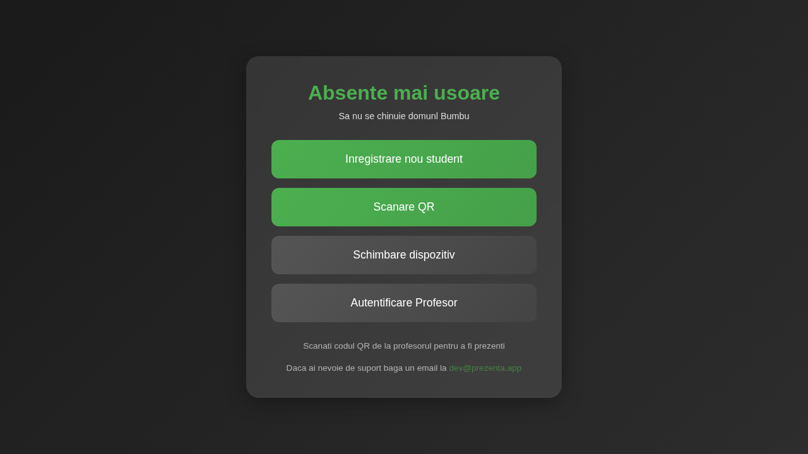
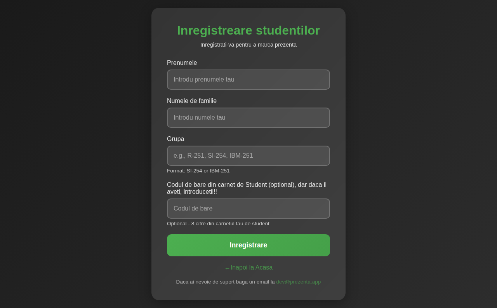
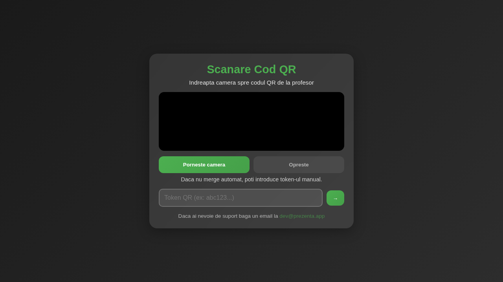
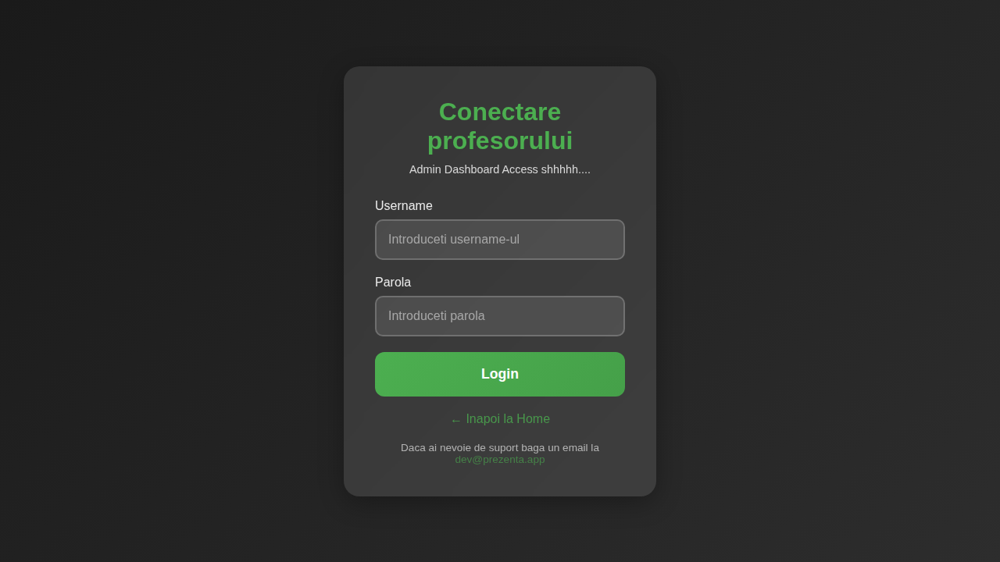
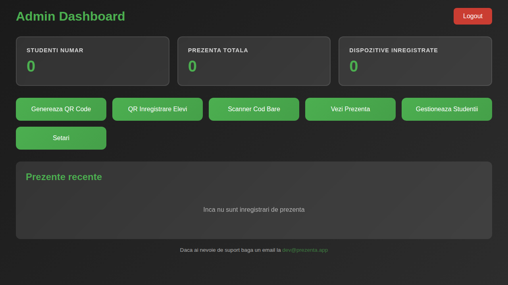
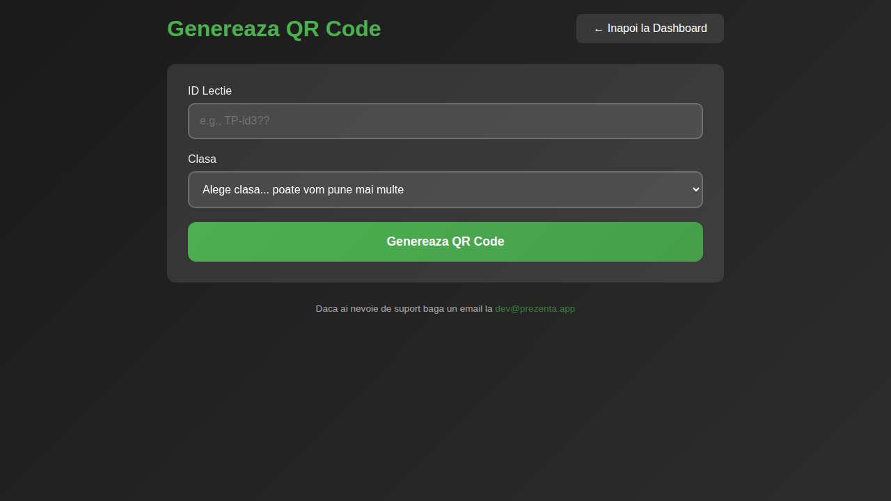
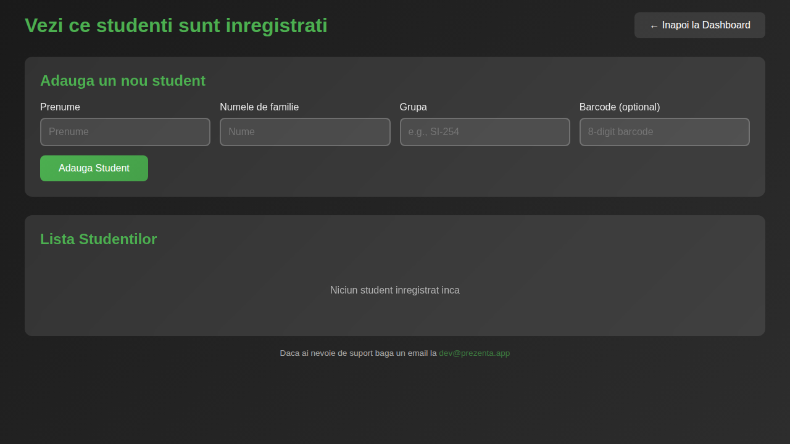

# Attendance System (Prezenta)

A modern, QR code-based attendance tracking system built with Flask, designed for educational institutions. The system allows students to mark their attendance by scanning QR codes generated by teachers, with additional security features like GPS verification and device management.

## 📱 Features

### For Students
- **Easy Registration**: Students can register themselves with their name, surname, group, and optional student ID barcode
- **QR Code Scanning**: Mark attendance by scanning teacher-generated QR codes
- **Device Management**: Secure device registration and re-registration with cooldown periods
- **GPS Verification**: Location-based attendance verification to ensure students are physically present in the classroom

### For Teachers/Admins
- **Admin Dashboard**: Comprehensive overview of students, attendance records, and registered devices
- **QR Code Generation**: Create time-limited QR codes for specific classes and locations
- **Student Management**: Add, view, and manage student records
- **Attendance Tracking**: View and export attendance records
- **Barcode Scanner**: Alternative method for marking attendance using student ID barcodes
- **Registration QR Codes**: Generate QR codes for easy student registration

## 📸 Screenshots

### Home Page


The home page provides quick access to all main features:
- Student registration
- QR code scanning for attendance
- Device re-registration
- Admin login

### Student Registration


Students can register by entering:
- First name (Prenumele)
- Last name (Numele de familie)
- Group/Class (Grupa)
- Optional student ID barcode (8 digits)

### QR Code Scanner


Students scan the teacher's QR code to mark attendance:
- Camera-based scanning
- Manual token entry option
- Real-time validation

### Admin Login


Secure admin access for teachers to manage the system.

### Admin Dashboard


The dashboard shows:
- Total number of registered students
- Total attendance records
- Number of registered devices
- Recent attendance entries
- Quick access to all admin features

### Generate QR Code


Teachers can generate time-limited QR codes by:
- Entering a lesson ID
- Selecting the classroom location
- QR codes are valid for a limited time (10 seconds by default)

### Student Management


Admin interface for:
- Adding new students manually
- Viewing all registered students
- Managing student records

## 🚀 Installation

### Prerequisites
- Python 3.7 or higher
- pip (Python package manager)

### Setup

1. Clone the repository:
```bash
git clone https://github.com/Somnial48/attendance-system.git
cd attendance-system
```

2. Create a virtual environment (recommended):
```bash
python3 -m venv .venv
source .venv/bin/activate  # On Windows: .venv\Scripts\activate
```

3. Install dependencies:
```bash
pip install -r requirements.txt
```

4. Run the application:
```bash
python3 start.py
```

The application will be available at `http://127.0.0.1:5000`

### Production Deployment

For production, use Gunicorn:
```bash
bash run.sh
```

Or manually:
```bash
gunicorn -w 3 -b 127.0.0.1:5000 start:app
```

## ⚙️ Configuration

Edit `config.py` to customize the system:

### Security Settings
```python
SECRET_KEY = 'your-secret-key-here'  # Change in production!
```

### QR Code Settings
```python
TOKEN_VALIDITY_SECONDS = 10  # QR code validity period
QR_TOKEN_BUFFER_SECONDS = 7  # Buffer for validation
SESSION_DURATION_SECONDS = 40  # Total session duration
DEVICE_REREGISTER_COOLDOWN_SECONDS = 120  # Cooldown after attendance
```

### GPS Verification
```python
GPS_VERIFICATION_ENABLED = True  # Enable/disable GPS checks
```

### Classroom Locations
```python
CLASSROOMS = {
    '6-2': {
        'name': '6-2',
        'lat': 47.0617782,
        'lng': 28.8679226,
        'radius_meters': 50
    },
}
```

### Allowed IP Addresses
```python
ALLOWED_PUBLIC_IPS = [
    '81.180.',  # Add your network prefixes
]
```

## 📝 Usage

### For Students

1. **First Time Setup**:
   - Visit the home page
   - Click "Inregistrare nou student" (Register new student)
   - Fill in your details
   - Enable GPS and WiFi on your device

2. **Marking Attendance**:
   - Click "Scanare QR" (Scan QR)
   - Allow camera access
   - Scan the QR code displayed by your teacher
   - Alternatively, enter the token manually

3. **Changing Device**:
   - Click "Schimbare dispozitiv" (Change device)
   - Follow the re-registration process

### For Teachers

1. **Login**:
   - Click "Autentificare Profesor" (Teacher Login)
   - Enter your credentials
   - Default: username `Bumbu`, password `hello` (change in production!)

2. **Generate QR Code for Class**:
   - Go to "Genereaza QR Code"
   - Enter the lesson ID
   - Select the classroom
   - Display the generated QR code to students

3. **Manage Students**:
   - Go to "Gestioneaza Studentii"
   - Add students manually or view registered students
   - Export student lists

4. **View Attendance**:
   - Go to "Vezi Prezenta"
   - Filter by date, student, or class
   - Export attendance records

## 🗄️ Database

The system uses SQLite by default, with the database file stored at `data/attendance.db`. The database includes tables for:
- Students
- Teachers
- Devices
- Attendance records
- QR tokens
- Device cooldowns

## 🔒 Security Features

- **Password Hashing**: All passwords are hashed using SHA-256
- **Token Management**: QR tokens are time-limited and single-use
- **Device Tracking**: Each student device is registered and tracked
- **GPS Verification**: Ensures students are physically present in the classroom
- **IP Restrictions**: Optional IP whitelist for additional security
- **Cooldown Periods**: Prevents rapid re-registration and abuse

## 🛠️ Password Reset

To reset a teacher's password:
```bash
python3 reset_password.py
```

## 📧 Support

For support, email: dev@prezenta.app

## 📄 License

This project is provided as-is for educational purposes.

## 🤝 Contributing

Contributions are welcome! Please feel free to submit pull requests or open issues for bugs and feature requests.

---

Made with ❤️ for easier attendance tracking
